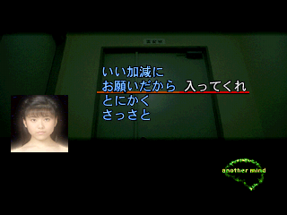
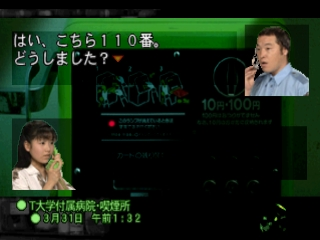
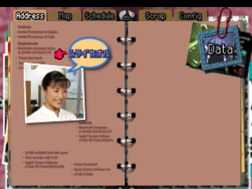

# Another Mind Decompilation Project

<p align="center">
  
</p>

### A byte-matching decompilation project for Squaresoft's FMV visual novel *Another Mind* for the PlayStation 1.

---

Set in modern-day Japan, you awaken as a voice inside the mind of 16-year-old high school student Hitomi Hayama. Together, you are thrust into the center of a mystery involving a murder, suicide attempts, and an attempted bombing. 

You communicate with Hitomi using an innovative dialogue system—constructing your own sentences out of context-sensitive keywords and phrases provided by the game, rather than simply choosing from predetermined options.

This game is in Japanese and was never released outside Japan.

| | |
|:---:|:---:|
|  |  |
|  |  |

---

## Getting Started

### 1. Clone the Repository
Clone the repository and its submodules recursively:

```shell
git clone --recursive git@github.com:halkuncode/anothermind-decomp.git
cd anothermind-decomp
```

If you previously cloned without `--recursive`, initialize submodules with:
```shell
git submodule update --init --recursive
```

### 2. Install System Dependencies

#### Debian / Ubuntu
```shell
sudo add-apt-repository ppa:longsleep/golang-backports
sudo apt update
sudo apt install golang-go ninja-build 7zip bchunk binutils-mipsel-linux-gnu gcc-mipsel-linux-gnu
# Optional: install doxygen to generate documentation with `make doc`
sudo apt install doxygen
```

#### Arch Linux
```shell
sudo pacman -S go ninja 7zip bchunk
yay -S mipsel-linux-gnu-binutils mipsel-linux-gnu-gcc
# Optional: install doxygen to generate documentation with `make doc`
sudo pacman -S doxygen
```

### 3. Set Up Python Virtual Environment
Install required Python dependencies (splat, etc.):
```shell
make requirements
```

### 4. Provide the Game Disc
Place your Japanese retail disc image files into the `disk/` directory:
- `disk/Another Mind (Japan).bin`
- `disk/Another Mind (Japan).cue`

### 5. Extract Disc Data
Extract the game files and executable (`SLPS_016.55`):
```shell
make disk
```

### 6. Build and Verify
Compile the project and verify byte-matching checksums:
```shell
make check
```

---

## Available Make Targets

| Target | Description |
| :--- | :--- |
| `make all` | Default target. Extracts disc data and builds the executable (`disk` + `build`). |
| `make requirements` | Creates the Python virtual environment (`.venv`) and installs `requirements.txt`. |
| `make disk` | Converts BIN/CUE to ISO using `bchunk` and extracts game assets and `SLPS_016.55` with `7z`. |
| `make build` | Ensures compiler toolchain is ready, generates ninja rules, and builds `build/jp/another.exe`. |
| `make check` | Runs `make build` and validates SHA-1 checksums against the retail `SLPS_016.55`. |
| `make clean` | Cleans up build artifacts, ninja logs, intermediate object files, and generated docs. |
| `make doc` | Generates HTML documentation using Doxygen into `docs/html/index.html` (optional, requires `doxygen`). |
| `make rebuild` | Runs a clean build (`make clean` followed by `make build`). |
| `make format` | Formats all C codebase files using `clang-format`. |
| `make submit` | Runs `make clean`, `make build`, `make format`, and stages `config/`, `include/`, and `src/` with `git add`. |
| `make ctx FILE=<path>` | Generates `ctx.c` context file (used for [decomp.me](https://decomp.me) or `m2c`) for a C file (e.g. `make ctx FILE=src/main.c`). |

---

## Decompilation Workflow

### 1. Decompile a Function
Use `mako.sh` to disassemble and decompile a function placeholder from assembly into C:
```shell
./mako.sh dec <function_name>
```
This replaces `INCLUDE_ASM` in the corresponding C file with decompiled C code from `m2c`.

### 2. Generate Context for decomp.me
Generate a preprocessed context file (`ctx.c`) to import into [decomp.me](https://decomp.me):
```shell
make ctx FILE=src/main.c
# Or invoke m2ctx directly:
python3 tools/m2ctx.py src/main.c
```
*(The generated `ctx.c` is automatically ignored by Git).*

### 3. Check Matching Progress
Verify your changes compile and match the target binary:
```shell
make check
```

### 4. Other Helper Commands
```shell
# Rank non-decompiled functions from easiest to hardest
./mako.sh rank

# Generate a progress report
./mako.sh report
```

### 5. Generate Documentation (Optional)
The codebase uses Doxygen-formatted comments. Doxygen is completely optional and not required to build or contribute, but if you have `doxygen` installed, you can generate local HTML documentation:
```shell
make doc
```
The documentation will be generated in `docs/html/index.html` (untracked by Git). The configuration file is tracked at `docs/Doxyfile`.
